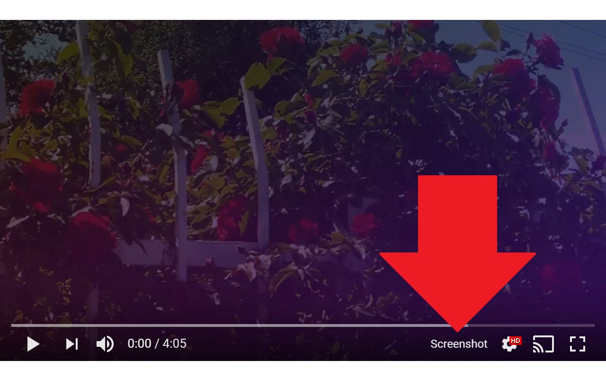

# [Screenshot YouTube](https://chrome.google.com/webstore/detail/screenshot-youtube/gjoijpfmdhbjkkgnmahganhoinjjpohk) – a Chrome extension
Take a screenshot of any YouTube video with one click. [Get on Chrome Web Store →](https://chrome.google.com/webstore/detail/screenshot-youtube/gjoijpfmdhbjkkgnmahganhoinjjpohk)

This extension does not contain any malicious or tracking code. No viruses. No ads. Only good software.

## Status: finished and functional

No updates planned at the moment.

## Found an error? Have any issues or feature requests?

Please add them in the <em>Issues</em> section.

## [Please consider supporting on Patreon!](https://www.patreon.com/FutureMillennium)

Made by [Zdeněk Gromnica aka FutureMillennium](http://futuremillennium.com/).
